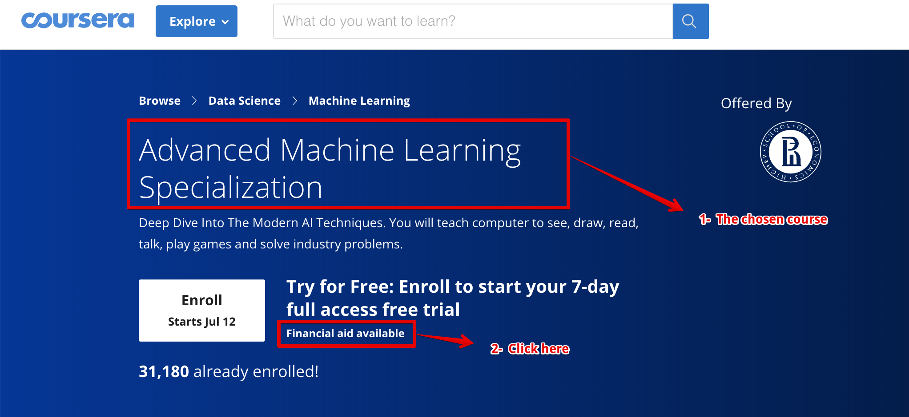
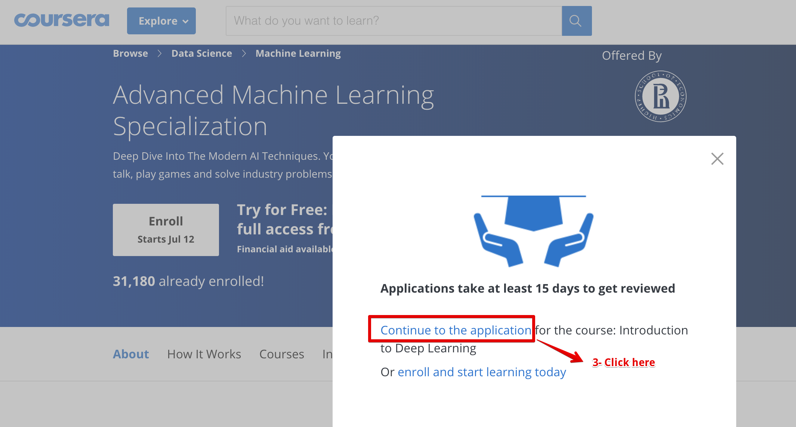
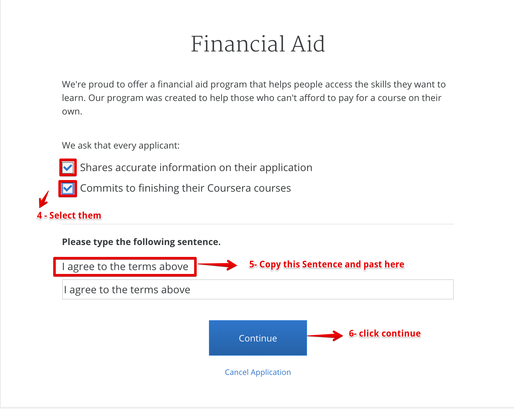
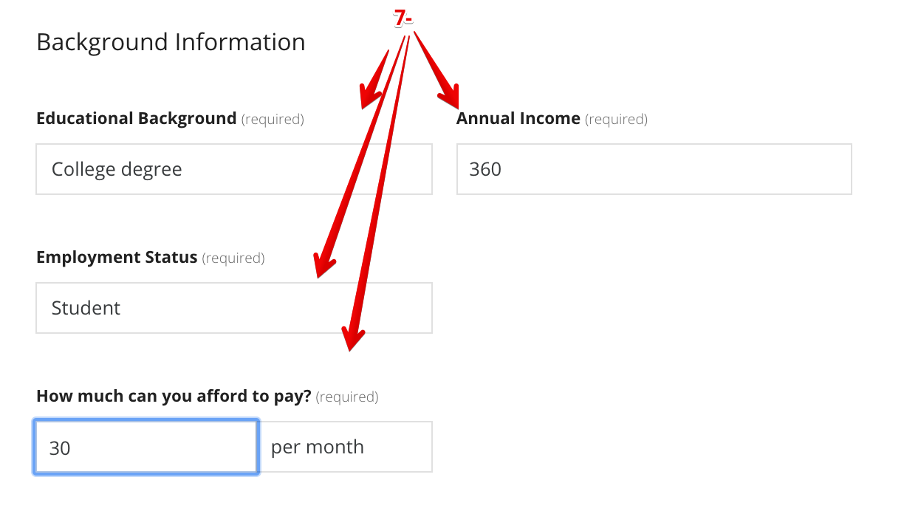
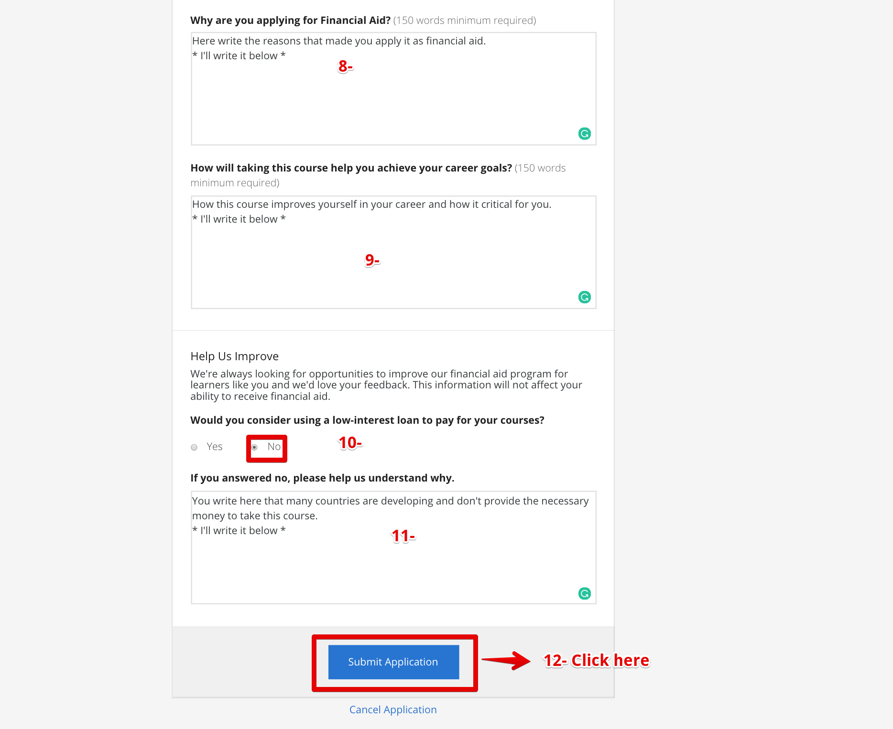
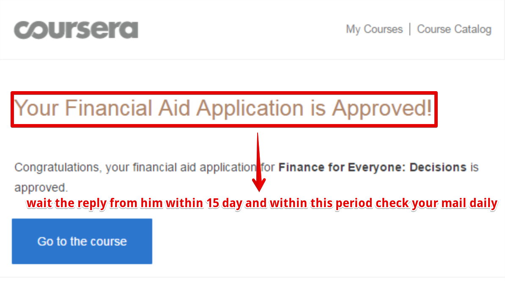

# Applying for financial aid on coursera 

## Everything between quotes you should change it 

## Why are you applying for Financial Aid? (150 words minimum required)
Hello, my name is "your name" and I live in "your country", the country in development. I'm applying for Financial Aid for the course "Course name" because I do not have any special source of income and I don't earn enough money and I can't afford the full tuition at this time of my life and career.
Receiving Financial Aid for this course will help me get valuable knowledge in "write your career neme like machine learening" ,  and I am searching for a job from a long time for earning money for taking this course, and I have not found yet, and the time goes on, and receiving financial aid will allow me to focus on my studies and by taking it, it may allow me to take off a paid internship and take another course in machine learning path .
I want to invest in my career and my education, but at this moment I can only invest my time to increase my knowledge and advance in my career and not the money. Hopefully this will change in the upcoming years because I'm ambitious, I want to increase my programming knowledge and new technologies and I am eager to work and advance in my career.

## How will taking this course help you achieve your career goals? (150 words minimum required)
I have a solid background in "math and algorithms and problem-solving skills", so I am eager to learn "machine learning" and that's the course the first step to me to make good projects that help the humanity for an easy life and solve the big problem. 
My main career goal is to learn every day, I really want to learn and to progress in my career.
"Programming" requires continuous learning and this course can help me gain more knowledge.

I plan on gaining additional skills by taking related classes and continuing my involvement with a variety of professional associations and I noticed that there a lot of companies provide internships and jobs in the related field, and I would certainly be interested in taking it and improving my self to be on of the pioneers of "machine learning and deep learning."
There are many opportunities in this field that the candidate can join but must have good knowledge to join these opportunities, so I see that this course with good tutorials and exercises will help me to join in the world's largest companies and creativity in this area.

## If you answered no, please help us understand why.?
Because there are a lot of developing countries whose average rate of income is low and not enough for personal needs for home so it isn't enough to get paid courses, and we need a lot of free courses for learning and improving ourselves to help the humanity and society.
